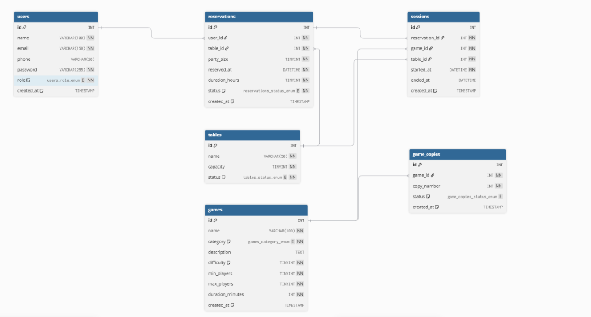
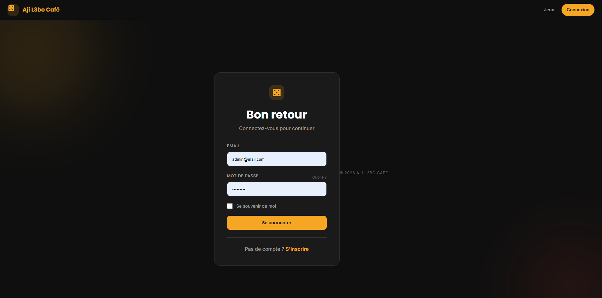
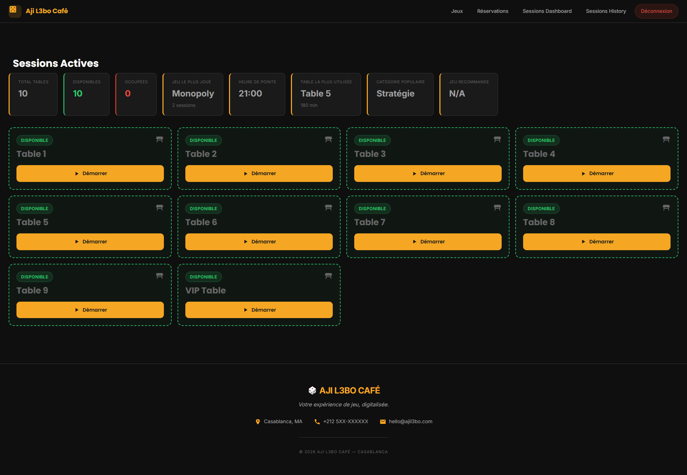
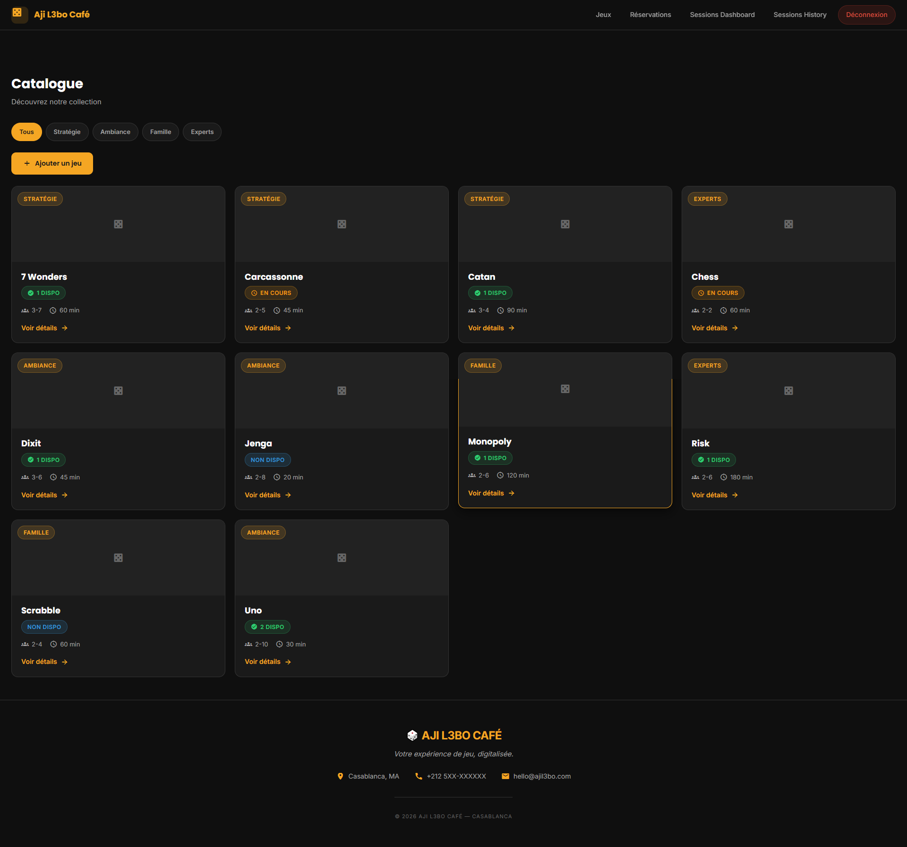
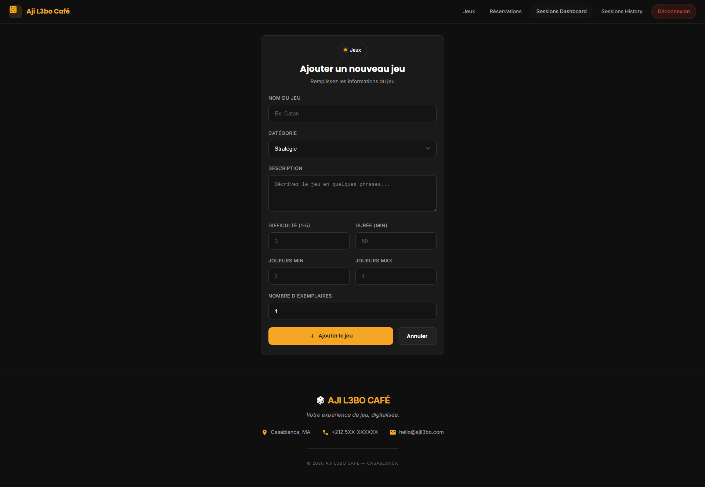
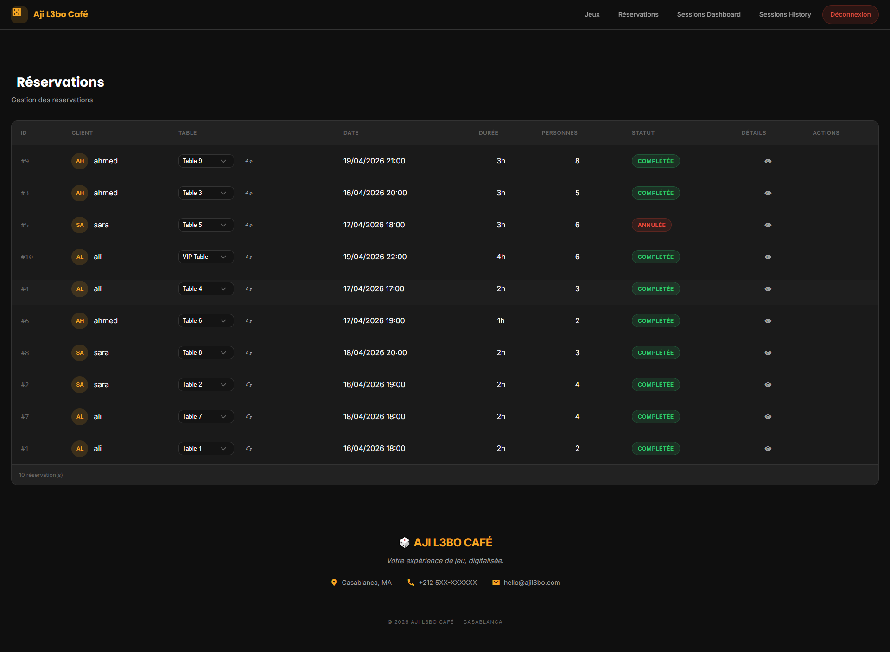
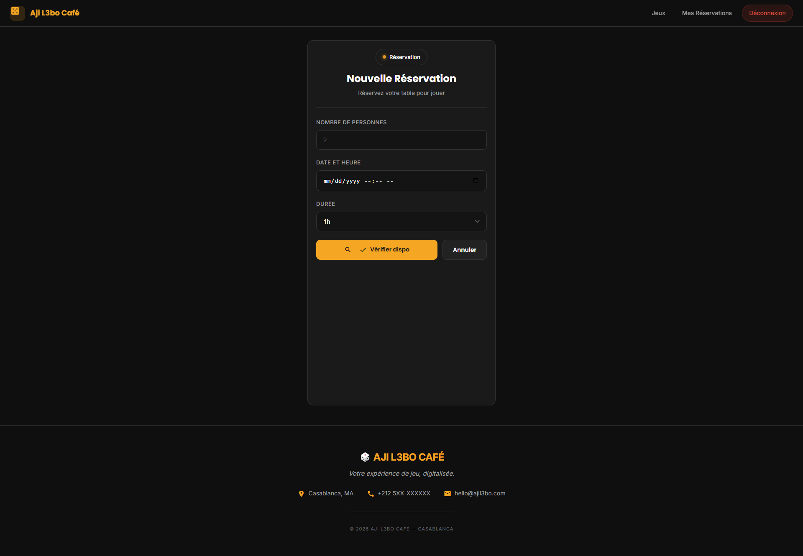
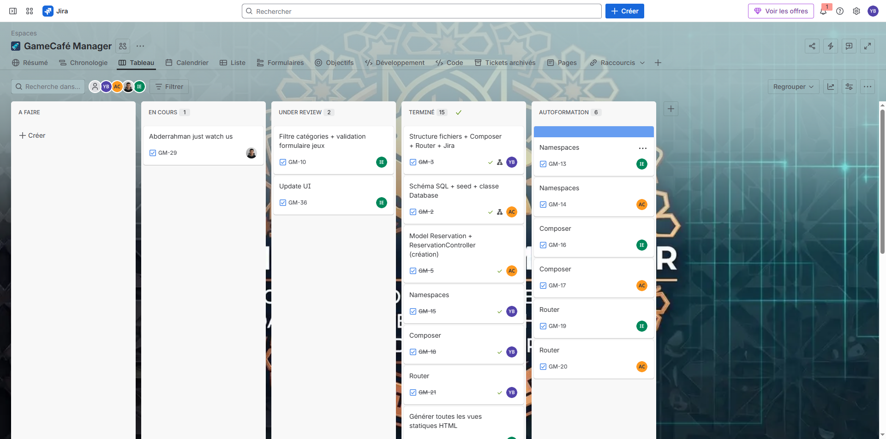

# GameCafé Manager

## Overview

GameCafé Manager is a web-based platform developed for Aji L3bo Café (Casablanca) to fully digitalize the management of board games, reservations, and gaming sessions.

The system replaces manual processes (paper reservations, notebook inventory tracking, and chaotic session management) with a centralized and structured solution.

The application follows MVC architecture, uses Object-Oriented Programming (OOP) principles, and implements a custom Router with PSR-4 Namespaces and Composer autoloading for a clean and scalable codebase.

---

## 🚀 Features

### 🎲 Game Catalogue (Client & Admin)

- Browse all available board games.
- View detailed information:
  - Name
  - Category (Stratégie, Ambiance, Famille, Experts)
  - Difficulty (1–5)
  - Players (min/max)
  - Duration
  - Availability (copies available)
- Filter games by category.

### 👑 Admin

- Add new games.
- Edit existing games.
- Delete games.
- Manage game copies (inventory system).

### 📅 Reservation System

#### 👤 Client

- Create a reservation:
  - Date & time
  - Number of players
  - Duration
- View personal reservations (history).

#### 👑 Admin

- View all reservations.
- Confirm or cancel reservations.
- Assign tables dynamically.
- Check table availability (no overlap system).

### 🕹️ Session Management

#### 👑 Admin Only

- Start a game session:
  - Link reservation + game + table
- Live dashboard:
  - Active sessions
  - Occupied tables
  - Time elapsed
- End a session:
  - Free table
  - Update game copy status
- View session history.

### 📊 Bonus Features (Statistics)

- Most played games.
- Peak hours.
- Table usage analytics.
- Category-based statistics.

---

## Installation

### Prerequisites

- Git
- XAMPP (Apache + MySQL)
- PHP 8+
- Composer

---

### Steps

1. **Start XAMPP**
   - Open XAMPP Control Panel
   - Start Apache and MySQL

2. **Clone the repository**

```bash
cd C:\xampp\htdocs
git clone https://github.com/BEN-ESSAHRAOUI-Yassine/GameCafe_Manager_PRJ.git
```

3. **Install dependencies**

```bash
composer install
```

- open GameCafe_Manager_PRJ/composer.json in VScode, run in terminal

```bash
composer dump-autoload
```

4. **Import the database**

- Open phpMyAdmin.
- Create a database Aji_L3bo_Cafe.
- Import the sql file (schema + seed) from the database folder.

5. **Configure the project**

Open app/config/database.php and set your database credentials:

```bash
$host = "localhost";
$dbname = "Aji_L3bo_Cafe";
$username = "root";
$password = "";
```

6. **Access the project**

Open your browser and go to:

```bash
http://localhost/GameCafe_Manager_PRJ/public/
```

---

## Technologies Used

- PHP 8+ (Core PHP)
- MySQL (Relational database)
- Composer (PSR-4 Autoloading)
- PDO (Prepared statements)
- HTML5 / CSS3
- JavaScript
- MVC Architecture
- Namespaces (PSR-4)
- Custom Router
- Session-based authentication

---

## Directory Structure

```
└── 📁app
    └── 📁Config
        ├── database.php
    └── 📁Controllers
        ├── AuthController.php
        ├── GameController.php
        ├── ReservationController.php
        ├── SessionController.php
    └── 📁Models
        ├── Game.php
        ├── GameCopy.php
        ├── Reservation.php
        ├── Session.php
        ├── Table.php
        ├── User.php
    └── 📁Views
        └── 📁auth
            ├── login.php
            ├── register.php
        └── 📁games
            ├── create.php
            ├── edit.php
            ├── index.php
            ├── show.php
        └── 📁layouts
            ├── footer.php
            ├── header.php
        └── 📁reservations
            ├── create.php
            ├── index.php
            ├── my-reservations.php
            ├── show.php
        └── 📁sessions
            ├── create.php
            ├── dashboard.php
            └── history.php
└── 📁core
    └── 📁Middleware
        ├── AdminMiddleware.php
        ├── AuthMiddleware.php
    ├── Controller.php
    ├── Database.php
    └── Router.php
└── 📁database
    ├── schema.sql
    └── seed.sql
└── 📁public
    └── 📁Asset
        └── 📁imgs
            ├── AddGame.png
            ├── DashboardJira.png
            ├── DashboardReservation.png
            ├── DashboardSession.png
            ├── db_diagram.png
            ├── GameCatalog.png
            ├── Login.png
            ├── MakeReservation.png
    └── 📁css
        ├── Style.css
    └── 📁js
        ├── app.js
        ├── Style.js
    ├── .htaccess
    └── index.php
└── .gitignore
└── Composer.json
└── README.md
```

---

## Security Measures

- Password hashing with `password_hash()` / `password_verify()`.
- Role-based access control (Admin vs client).
- Prepared statements using PDO to prevent SQL injection.
- Input validation and sanitization.
- Session-based authentication.

---

## 🔀 Routing System

All requests go through:

```bash
public/index.php
```

### Examples

| Method | Route               | Controller                  |
| ------ | ------------------- | --------------------------- |
| GET    | /games              | GameController@index        |
| GET    | /games/5            | GameController@show         |
| POST   | /games              | GameController@store        |
| GET    | /reservations       | ReservationController@index |
| POST   | /reservations       | ReservationController@store |
| GET    | /sessions/dashboard | SessionController@dashboard |

---

## 👥 User Roles

### 👤 Client

- Log in.
- Register a new account.
- Browse games
- Create reservations
- View personal reservations

### 👑 Admin

- Log in as admin.
- Manage games (CRUD)
- Manage reservations
- Manage sessions
- Access dashboard & statistics

## Database Design

### DB Diagram



### Tables

- **users** → user accounts
- **games** → game information
- **game_copies** → inventory tracking
- **tables** → café tables
- **reservations** → bookings
- **sessions** → active/finished sessions

### Relationships

- One user → many reservations (1-N)
- One game → many copies (1-N)
- One reservation → one session (1-1)
- One table → many sessions (1-N)

- Foreign keys ensure referential integrity.

## Test Accounts

You can use the following pre-seeded accounts to test the application:

| Role   | email          | Password  |
| ------ | -------------- | --------- |
| Admin  | admin@mail.com | adminpass |
| Client | ali@mail.com   | chefpass  |
| Client | sara@mail.com  | chefpass  |
| Client | ahmed@mail.com | chefpass  |

> ⚠️ These accounts are for development/testing purposes only.

## Notes

- Tables cannot be double-booked (availability system).
- Game copies are tracked individually.
- Ending a session automatically:
  - Frees the table
  - Updates reservation status
  - Updates game copy availability

## 👨‍💻 Team & Workflow

### 🗓️ Vue d'ensemble

| ID   | Assigné       | Titre                                                          | Phase   | Dépend de  |
| ---- | ------------- | -------------------------------------------------------------- | ------- | ---------- |
| T-01 | **Ilyas**     | Générer toutes les vues statiques HTML                         | Phase 0 | —          |
| T-02 | **Abdelatif** | Schéma SQL + seed + classe Database                            | Phase 0 | —          |
| T-03 | **Yassine**   | Structure fichiers + Composer + Router + Jira                  | Phase 0 | —          |
| T-04 | **Ilyas**     | Model Game + GameController (lecture)                          | Phase 1 | T-02, T-03 |
| T-05 | **Abdelatif** | Model Reservation + ReservationController (création)           | Phase 1 | T-02, T-03 |
| T-06 | **Yassine**   | Model User + AuthController (register/login/logout)            | Phase 1 | T-02, T-03 |
| T-07 | **Ilyas**     | GameController — CRUD Admin (create/edit/delete)               | Phase 2 | T-04       |
| T-08 | **Abdelatif** | Disponibilité tables + "Mes Réservations"                      | Phase 2 | T-05, T-06 |
| T-09 | **Yassine**   | Model Session + SessionController (dashboard + start)          | Phase 2 | T-05, T-06 |
| T-10 | **Ilyas**     | Filtre catégories + validation formulaire jeux                 | Phase 3 | T-07       |
| T-11 | **Abdelatif** | Admin réservations (liste + confirmer/annuler)                 | Phase 3 | T-08       |
| T-12 | **Yassine**   | SessionController (end session + historique) + nettoyage Guard | Phase 3 | T-09       |

### [Link Jira](https://ybenessahraoui.atlassian.net/jira/software/projects/GM/boards/35?atlOrigin=eyJpIjoiYjY2NGYxYzg1ZTdmNGU3YmJkYzUxY2Q5NzY0ZDBjMzIiLCJwIjoiaiJ9)

### [Link Documented Daily standups + (Mid-week and final)retrospective](https://docs.google.com/document/d/1HTtliOZt_IFKxb4A0Wq4IgEu4yuhHzlHYcHm1ur_Rh4/edit?usp=sharing)

## Screenshots

### Login page



### Session Dashboard(Admin)



### Game Catalogue



### Add Game



### Reservation Dashboard



### Make a Reservation as client



### Screenshot du board Jira final


